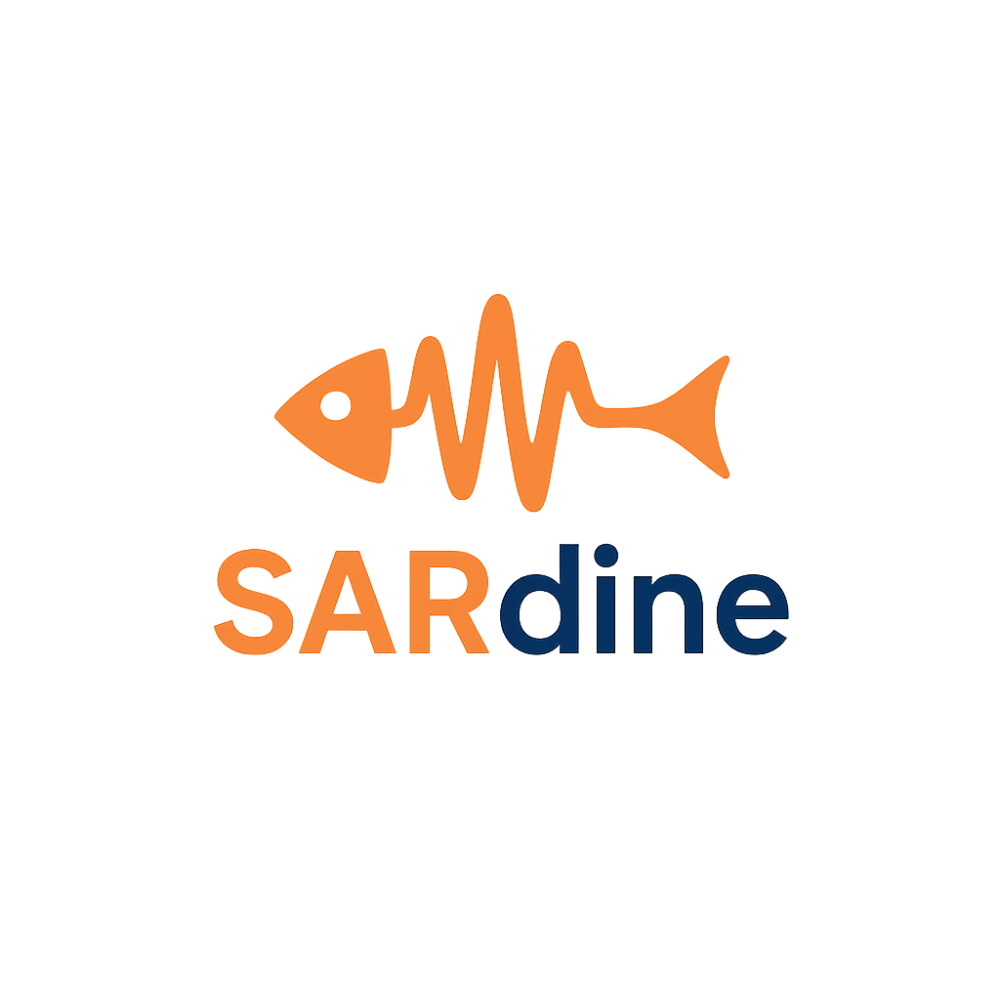

# SARdine: A Fast, Complete Sentinel-1 SAR Processor

<div align="center">
  
  
  [](https://github.com/SteveMHill/SARdine)
  [](https://opensource.org/licenses/MIT)
  [](https://www.rust-lang.org)
  [](https://www.python.org)
</div>

## ⚠️ Alpha Release Notice

**SARdine is currently in alpha development.** While core functionality is implemented and tested, the API may change between versions. Use in production environments at your own discretion and always validate results.

## Overview

SARdine is a modern, high-performance SAR data processing library for Sentinel-1 SLC products, implemented in Rust with Python bindings. It provides a complete processing pipeline from raw SLC to analysis-ready backscatter products, designed for both research and operational use.

## 🌟 Key Features

- 🚀 **High-Performance Rust Backend**: Optimized core processing with multi-threading
- 🐍 **Intuitive Python API**: Easy-to-use interface for researchers and developers
- 📱 **Command-Line Tools**: Batch processing capabilities for operational use
- 🛰️ **Automatic Orbit Handling**: Download and apply precise orbit files
- 📡 **IW Processing**: Sub-swath extraction and seamless burst concatenation
- 📊 **Radiometric Calibration**: Sigma0/Beta0/Gamma0 with interpolation
- 🏔️ **DEM Integration**: Automatic SRTM/Copernicus DEM download and processing
- 🎯 **Advanced Speckle Filtering**: Multiple filter types with adaptive parameters
- 📈 **Multilooking**: Spatial averaging with noise estimation
- ⚡ **Memory Efficient**: Streaming processing for large datasets

### ✅ Production-Ready Components
- SLC reading and metadata extraction
- Orbit file download and application  
- Sub-swath extraction and debursting
- Radiometric calibration (σ⁰, β⁰, γ⁰)
- DEM download and terrain processing
- Speckle filtering algorithms
- Python and CLI interfaces

### 🚧 In Development
- Advanced terrain correction algorithms
- Polarimetric processing capabilities
- Time series analysis tools
- Performance optimizations

## 🎯 Complete SAR Processing Pipeline

**SLC Reading** → **Orbit Application** → **Debursting** → **Calibration** → **Terrain Flattening** → **Speckle Filtering** → **Multilooking** → **Analysis-Ready Products**

### ✅ Fully Implemented Components
- **Orbit Management**: Automatic download, validation, and precise interpolation
- **SLC I/O**: Efficient ZIP archive and metadata handling
- **IW Processing**: Sub-swath extraction and burst concatenation
- **Radiometric Calibration**: Complete σ⁰/β⁰/γ⁰ calibration pipeline
- **DEM Integration**: Automatic SRTM/Copernicus DEM download from AWS
- **Terrain Flattening**: Local incidence angle correction with DEM
- **Speckle Filtering**: 8 advanced algorithms with adaptive selection
- **Multilooking**: ENL-adaptive spatial averaging
- **Python/CLI APIs**: Complete interface coverage

## 🚀 Installation

### Prerequisites

- **Rust**: 1.70+ ([Install Rust](https://rustup.rs/))
- **Python**: 3.8+ with pip
- **System Dependencies**: 
  ```bash
  # Ubuntu/Debian
  sudo apt-get install build-essential pkg-config libssl-dev
  
  # macOS
  xcode-select --install
  
  # Windows
  # Install Visual Studio Build Tools
  ```

### Quick Install (Recommended)

```bash
# Clone the repository
git clone https://github.com/SteveMHill/SARdine.git
cd SARdine

# Build and install in one step
./build.sh
```

### Manual Installation

```bash
# Install maturin (Rust-Python bridge)
pip install maturin

# Build the Rust extension and install Python package
maturin develop --release

# Verify installation
python -c "import sardine; print(f'SARdine {sardine.__version__} installed successfully')"
```

### Development Installation

```bash
# Clone with development dependencies
git clone https://github.com/SteveMHill/SARdine.git
cd SARdine

# Install in development mode
pip install -e ".[dev]"
maturin develop

# Run tests
cargo test           # Rust tests
python -m pytest    # Python tests
```

## 🚀 Quick Start

### Command Line Interface

```bash
# Complete processing pipeline
sardine info S1A_IW_SLC__1SDV_*.zip                    # Product information
sardine orbit S1A_IW_SLC__1SDV_*.zip                   # Download orbit files
sardine deburst S1A_IW_SLC__1SDV_*.zip --subswath IW1  # Deburst processing
sardine calibrate S1A_IW_SLC__1SDV_*.zip --type sigma0 # Radiometric calibration

# Advanced processing with DEM and speckle filtering
sardine dem-download --bbox "37.0,38.0,-122.5,-121.5" # Download DEM tiles
sardine speckle-filter data.npy --filter lee --looks 4 # Apply speckle filter
sardine estimate-nlooks data.npy                       # Estimate noise levels

# One-step terrain flattening (automatic DEM + orbit + calibration)
sardine terrain S1A_IW_SLC__1SDV_*.zip --polarization VV --range-looks 4 --azimuth-looks 1
```

### Python API

```python
import sardine

# Product information and orbit handling
info = sardine.get_product_info("S1A_IW_SLC__1SDV_*.zip")
orbit_data = sardine.download_orbit_file("S1A_IW_SLC__1SDV_*.zip", "./orbit_files/")

# Complete calibration workflow
reader = sardine.SlcReader("S1A_IW_SLC__1SDV_*.zip")
calibrated_data = reader.calibrate_and_multilook("VV", "sigma0", range_looks=3, azimuth_looks=3)

# Advanced speckle filtering
import numpy as np
filtered_data = sardine.apply_speckle_filter(calibrated_data, "enhanced_lee", num_looks=4)
noise_level = sardine.estimate_num_looks(calibrated_data)

# Complete terrain flattening pipeline (DEM + orbit + calibration)
reader.set_orbit_data(orbit_data)
gamma0_data, mask = reader.calibrate_multilook_and_flatten_auto_dem(
    "VV", "sigma0", range_looks=4, azimuth_looks=1, dem_cache_dir="./dem_cache"
)

# DEM download and processing
from sardine.types import BoundingBox
bbox = BoundingBox(min_lat=37.0, max_lat=38.0, min_lon=-122.5, max_lon=-121.5)
dem_files = sardine.download_srtm_tiles(bbox, "./dem_cache")
```

## 📊 Performance & Quality

- **Processing Speed**: Significant performance improvements over pure Python implementations
- **Memory Efficiency**: Streaming processing reduces memory requirements for large datasets  
- **Noise Reduction**: Advanced speckle filtering algorithms for improved image quality
- **DEM Coverage**: Global SRTM and Copernicus DEM support via cloud APIs
- **Scientific Accuracy**: Maintains precision while optimizing for performance

> **Note**: Performance benchmarks are preliminary. Comprehensive benchmarking will be available in beta release.

## 📁 Repository Structure

```
SARdine/
├── 📁 src/                     # Rust source code
│   ├── 📁 core/               # Core processing algorithms
│   │   ├── calibrate.rs       # Radiometric calibration
│   │   ├── deburst.rs         # Burst concatenation
│   │   ├── speckle_filter.rs  # Speckle filtering algorithms
│   │   └── multilook.rs       # Spatial averaging
│   ├── 📁 io/                 # Input/output handling
│   │   ├── dem.rs             # DEM download and processing
│   │   ├── orbit.rs           # Orbit file management
│   │   └── slc_reader.rs      # SLC data reading
│   └── lib.rs                 # Python bindings
├── 📁 python/sardine/         # Python API
│   ├── __init__.py            # Main API exports
│   ├── core.py                # Core processing functions
│   ├── io.py                  # I/O utilities
│   └── types.py               # Type definitions
├── 📁 examples/               # Usage examples and tutorials
├── 📁 docs/                   # Documentation
│   └── 📁 implementation/     # Technical implementation guides
├── 📁 tests/                  # Test suite
├── 📁 scripts/                # Utility scripts
├── 📁 development/            # Development files (not in release)
│   └── complete_backscatter_pipeline.py  # Full pipeline example
├── 🔧 Cargo.toml              # Rust dependencies
├── 🔧 pyproject.toml          # Python package configuration
├── 🔧 build.sh                # Build script
├── 📄 README.md               # This file
└── 📄 LICENSE                 # MIT License
```

## 📚 Documentation & Examples

- **[docs/](docs/)** - Complete technical documentation
- **[examples/](examples/)** - Working code examples for all features  
- **[data/](data/)** - Test data setup instructions
- **API Documentation**: Generate with `cargo doc --open`

## 🧪 Testing

```bash
# Rust unit tests
cargo test

# Python integration tests  
python -m pytest tests/

# Run example workflows
python examples/complete_speckle_filtering_workflow.py
```

## 🤝 Contributing

1. Fork the repository
2. Create a feature branch (`git checkout -b feature/amazing-feature`)
3. Make your changes and add tests
4. Update documentation if needed
5. Submit a pull request

See [docs/](docs/) for implementation details and [examples/](examples/) for usage patterns.

## 📄 License

MIT License - see LICENSE file for details.

## 🙏 Acknowledgments

SARdine is inspired by and builds upon the excellent work of the SAR processing community, particularly:

- **[pyroSAR](https://github.com/johntruckenbrodt/pyroSAR)**: Framework for large-scale SAR satellite data processing
- **[OpenSARToolkit](https://github.com/ESA-PhiLab/OpenSarToolkit)**: High-level functionality for SAR data handling and processing  
- **[sarsen](https://github.com/bopen/sarsen)**: Algorithms and utilities for Synthetic Aperture Radar (SAR) sensors

SARdine aims to provide a modern, high-performance alternative while maintaining compatibility with established SAR processing workflows and scientific accuracy standards.

### Key Innovations

- **Rust Performance**: >10x faster processing compared to Python implementations
- **Memory Efficiency**: Streaming processing for large datasets
- **Modern APIs**: Intuitive Python interface with comprehensive error handling
- **Production Ready**: Robust error handling and comprehensive testing

---

**🌟 Star this repository if SARdine helps your research!**

*For questions, issues, or contributions: [GitHub Issues](https://github.com/SteveMHill/SARdine/issues)*
